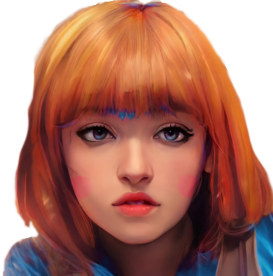

### ***Gui Gal*** is your open source virtual companion for design, engineering, and roleplay.

(Make your companion look like whatever you want with [Artbreeder](https://www.artbreeder.com/i?k=9584f4c4da5e3870fedd5c02c676 "Artbreeder"))

#### Values
* Playful
* Aesthetic
* Performant

#### Roadmap
* Visual symbol interface (scale, round corners, custom shader composition)
* Symbol graph persistence (component and system module saving/loading, interoperable resource format import/export (like html or tiff))
* Game underlay UX (interacting with a distinct flecs world as a symbol, wearenotart demo)
* libclang runtime (live component and system manipulation)
* Reverse engineer PureRef save format and create coverter
* Video symbol
* Web editor
* Cloud project syncing
* local speech recognition dep
* local object detection search dep (probably Darknet YOLO or PyTorch)
* ECS port of FreeCAD
