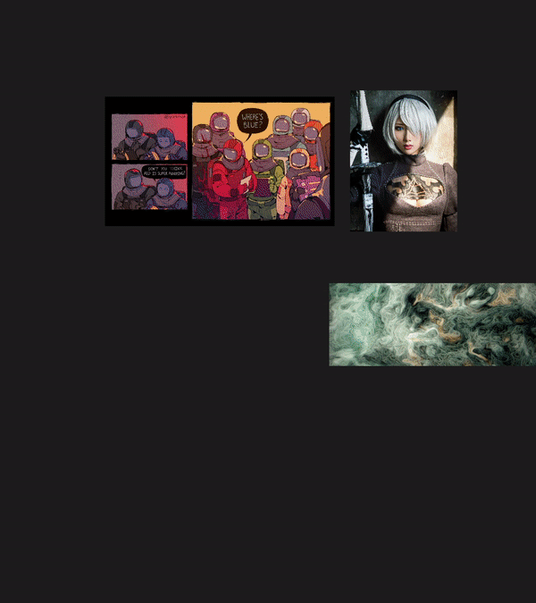

### ***Gui Gal*** is my virtual companion for design, engineering, and roleplay.

#### Values
* Playful
* Aesthetic
* Performant

#### Philosophy

>TLDR: An open source [PureRef](https://www.pureref.com/) for [Flecs](https://github.com/SanderMertens/flecs) projects

>Ever since Ada Lovelace learned to tie her shoes I have been scouring the internet for tools. I started programming when I was 15 using [Stencyl](http://www.stencyl.com/ "Stencyl") to make mobile apps and [Flash](https://www.youtube.com/watch?v=uhvey_FjtXA "Flash games r cool") games. My productivity was stellar, but I was limited in what I could create without an understanding of Haxe, linear algebra, and underlying hardware capabilities.
>* I learned Python and tried to use Pygame, my game was too slow at runtime.
>* I learned C++ and tried to write game engines from scratch, my game took too long to program.
>* I learned Unity, Unreal, and Godot... I felt like my designs were distorted to standardize into these frameworks: preconceived geometric hierarchies and syntactical constraints about how paracosms should be expressed.

>I dream of better workflows, personalized interfaces co-evolved with AI, where scene graphs melt into the aether: replaced by contextual intent expression. 

#### Roadmap
* Continous learning recommendation reinforcement learning for rating/iterating multimodal AI generated content
* libclang runtime (live component and system manipulation)
* Experiment with using LLM with codegen for Flit's visual system loop builder
* Replace OpenGL renderer with Vulkan
* Integrate MuJoCo/neural networks for physics simulation
* Digital human of Gui with realtime multimodal model
* OpenSCAD with neuroevolution
* FPGA based neural architecture search function training
* VPT for task automation
* AI generated game/game engine service
